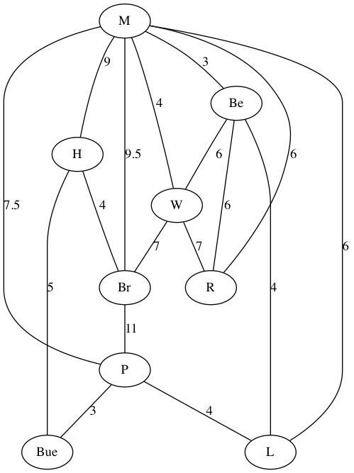

##Übungsblatt 2

###Aufgabe 1


Br - Berlin  
Be - Bern  
Bue - Brüssel  

####Adjazenzliste
```
M   --  H  --  P   --  Be  -- R -- Br -- W  
Be  --  M  --  L   --  W   -- R  
H   --  M  --  Br  --  Bue  
P   --  M  --  L   --  Bue  
L   --  M  --  Be  --  P  
W   --  Be --  M   --  R   -- Br  
Bue --  H  --  P  
R   --  M  --  Be  --  W
Br  --  H  --  M   --  W   -- P
````

####Adjazenzmatirix
```
    M B Be H P L W Bue R Br   
M  (0 0 1  1 1 0 1  0  0 1 )
B  (0 0 0  0 1 0 0  0  0 0 )
Be (1 0 0  0 0 1 1  0  1 0 )
H  (1 0 0  0 0 0 0  1  0 1 )
P  (1 0 0  0 0 1 0  1  0 0 )
L  (1 0 1  0 1 0 0  0  0 0 )
W  (1 0 1  0 0 0 0  0  1 1 )
Bue(0 0 0  1 1 0 0  0  0 0 )
R  (1 0 1  0 0 0 1  0  0 0 )
Br (1 0 0  1 1 0 1  0  0 0 )
```