**Jovan Gerodetti - AINF 2014 - ALGODAT - Die Probleme der Graphschaft Schilda**
##Die Probleme der Graphschaft Schilda

###1) Straßen müssen her!
####Graph
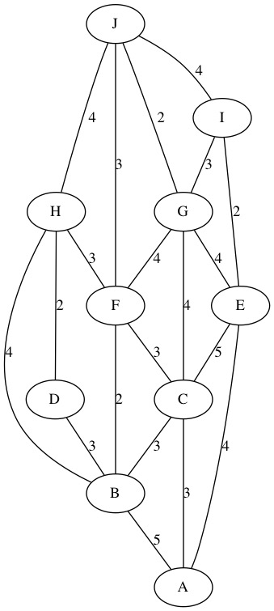

####Kruskal
#####Schritt 1

#####Schritt 2
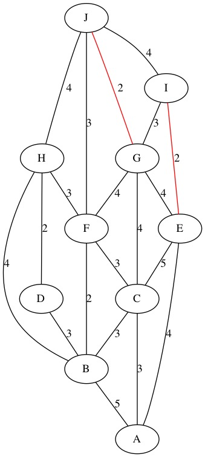

#####Schritt 3
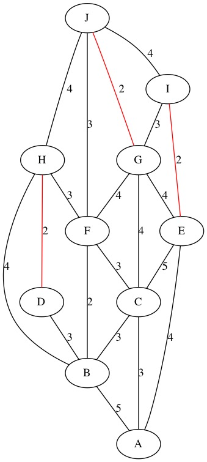

#####Schritt 4

#####Schritt 5
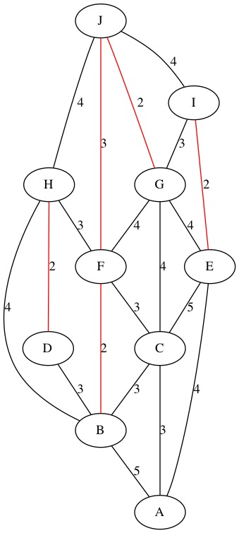

#####Schritt 6

#####Schritt 7
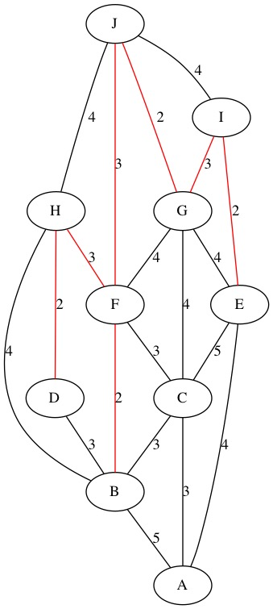

#####Schritt 8
but 

#####Ergebniss

###2) Wasserversorgung
####Ford-Fulkerson
#####Schritt 1

#####Schritt 2

#####Schritt 3

#####Schritt 4

#####Schritt 5

#####Schritt 6

#####Ergebniss
  
Ja der Supermarkt kann mit den benötigten 22m^2 Wasser versorgt werden.

###1) Historische Funde
####Graph
 

####Breitensuche
#####Schritt 1
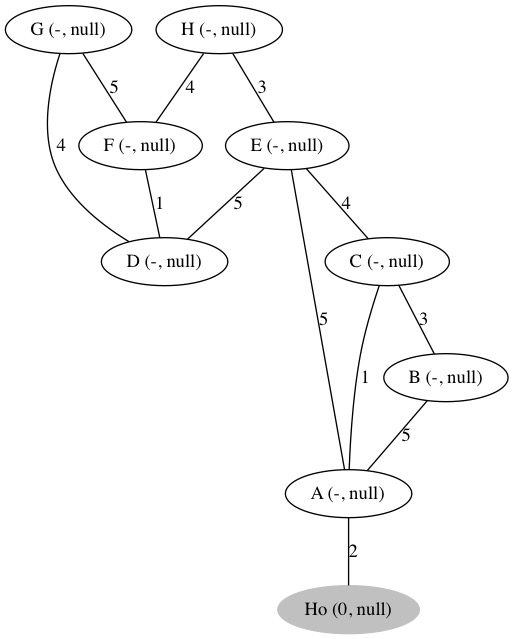 

#####Schritt 2
 

#####Schritt 3
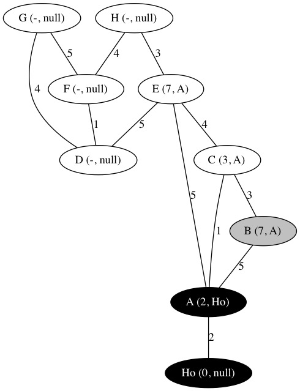 

#####Schritt 4
 

#####Schritt 5
 

#####Schritt 6
 

#####Schritt 7
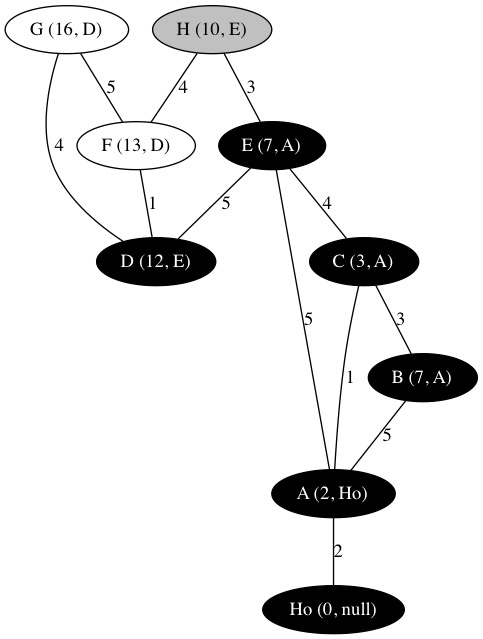 

#####Schritt 8
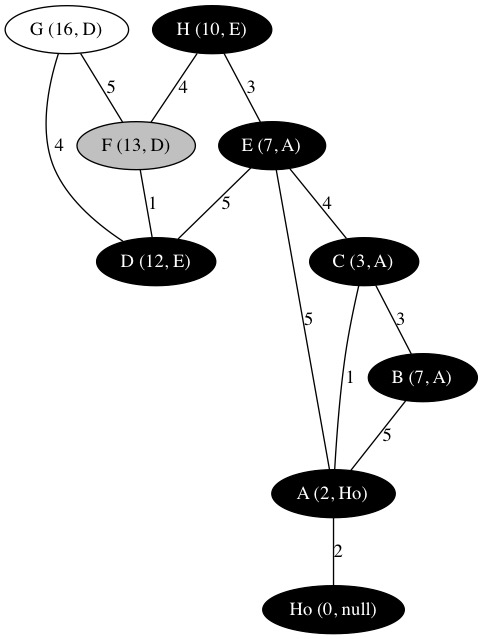 

#####Schritt 9
 

#####Schritt 10
 

#####Ergebniss

Reihenfolge:  
1) A  
2) C  
3) B, E  
4) H  
5) D  
6) F  
7) G

###4) Wohin nur mit den Gästen?
####Graph

####Ford-Fulkerson
#####Schritt 1

#####Schritt 2

#####Ergebniss
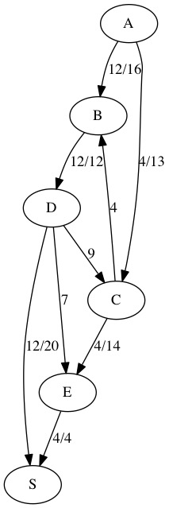

###5) Es gibt viel zu tun!
####Graph

#####Schritt 1

#####Schritt 2
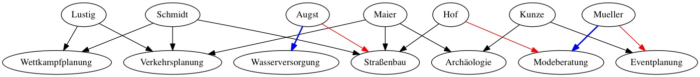

#####Schritt 3
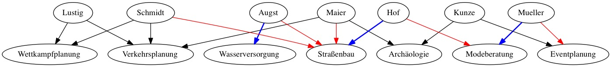

#####Schritt 4
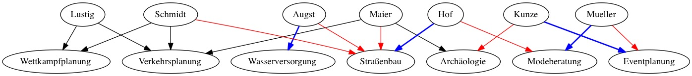

#####Schritt 5
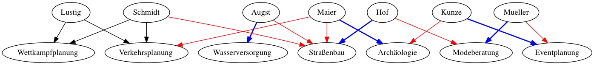

#####Schritt 6

#####Schritt 7
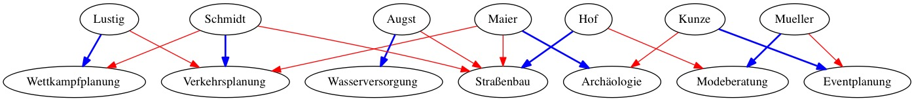

#####Ergebniss
| Name         | Projekt          |
| ------------ | ---------------- |
| Herr Maier   | Archäologie      |
| Frau Müller  | Modeberatung     |
| Frau Augst   | Wasserversorgung |
| Frau Schmidt | Verkehrsplanung  |
| Herr Kunze   | Eventplanung     |
| Herr Hof     | Straßenbau       |
| Frau Lustig  | Wettkampfplanung |